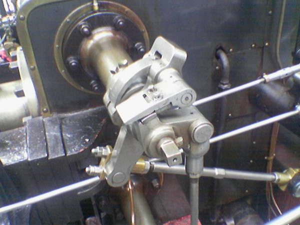
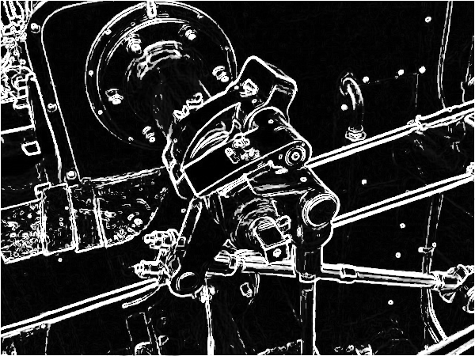

# Edge Detection Using Sobel Operation

## summary

In this project, the edge detection is implemented using sobel operation. The process can be done in CPU and GPU.

Three filters are implemented in this project, which are:

1. **grayscale filter** : convert the image to grayscale
2. **brightness filter** : adjust the brightness of the image
3. **sobel filter** : detect the edge of the image


### SEE THE RESULTS 😍

1. **grayscale filter**

<div style="text-align: center;">
  
  
</div>

2. **brightness filter**

<div style="text-align: center;">
  
  
</div>

3. **sobel filter**

<div style="text-align: center;">
  
  
</div>


## CPU implementation

The CPU directory is the one thread implementation of sobel operation.

### Pre-Requests

+ only **gcc**

### Compile

For compiling the CPU implementation, use follow command in `cpu/runners` directory.

```makefile
$ make
```

This command will generate the executable file for all three filters.

### Run

Run the executable file in `cpu/runners` directory.

```makefile
$ ./executable.out
```

write a NOTICE here about args

<div style="color: #fff; background-color: rgba(255,224,139,0.4); border: 1px solid #ffeb3b; padding: 10px;">
  <strong>Notice:</strong> The Guide of each executable file is written if you run the executable file without any args.
</div>

