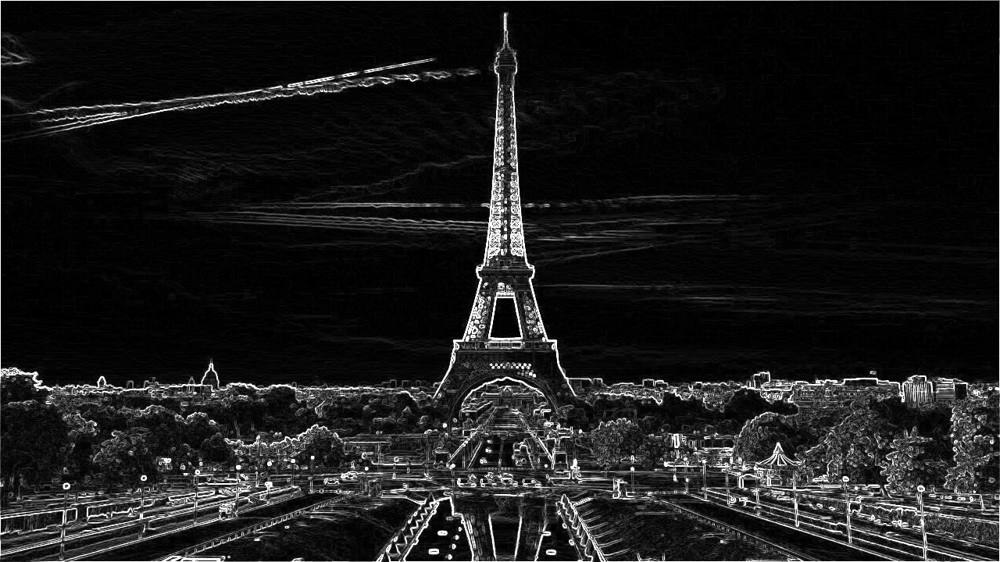
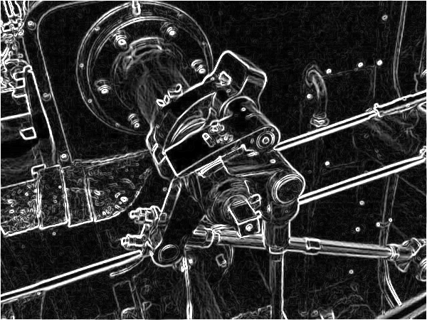

# Borde - GPU-accelerated edge detection using CUDA

Borde is a GPU-accelerated edge detection app written in C++ and CUDA.
It is designed to be fast, easy to use, and
easy to integrate into existing projects.
Borde is licensed under the MIT license.

## Features and Limitations :performing_arts:

**Features**:

+ **Well-Documented**: Borde is well-documented.
+ **Easy to Use**: Borde is easy to use.
+ **Configurable**: Borde is configurable and allows you to change the
  parameters of the edge detection algorithm.

**Limitations**:

+ **Only PNG**: Borde only supports PNG images for now.
+ **Only Sobel**: Borde only supports the Sobel operator for now.

## Demo Images :camera:

<h3> Eiffel Tower </h3>


<div style="display: flex; justify-content: space-between; margin-left: 10px; margin-right: 10px" >
    <div style="text-align: center">
        
    </div>
    <div style="text-align: center">
        
          </div>
</div>

<h3> Engine  </h3>


<div style="display: flex; justify-content: space-between; margin-left: 10px; margin-right: 10px" >
    <div style="text-align: center">
        
    </div>
    <div style="text-align: center">
        
    </div>
</div>

<h3> Flower and Butterfly </h3>


<div style="display: flex; justify-content: space-between; margin-left: 10px; margin-right: 10px" >
    <div style="text-align: center">
        
    </div>
    <div style="text-align: center">
        
    </div>
</div>

## Requirements :clipboard:

**CPU**:

+ CMake 3.10 or higher
+ GCC 7.5.0 or higher

**GPU**:

+ CUDA 10.1 or higher

## Compiling :hammer:

To compile Borde, Go to `./runners` and run the following commands:

For CPU version:

```makefile
$ make cpu
```

For GPU version:

```makefile
$ make gpu
```

after compiling, you can see the 3 executables in `./runners` directory.

1. brightness_filter_runner_cpu/gpu : for brightness filter
2. grayscale_filter_runner_cpu/gpu : for grayscale filter
3. sobel_filter_runner_cpu/gpu : for sobel filter

## Running :running:

After compiling, you can run the executables in `./runners` directory.

### Grayscale Filter

Run the Grayscale Filter with no arguments to see the usage and default values:

```bash
$ ./grayscale_filter_runner_cpu/gpu.out
```

Available arguments:

```bash
Usage: ./grayscale_filter_runner_cpu/gpu.out <input_path> <input_filename> <result_path>
```

### Brightness Filter

Run the Brightness Filter with no arguments to see the usage and default values:

```bash
$ ./brightness_filter_runner_cpu/gpu.out
```

Available arguments:

```bash
Usage: ./brightness_filter_runner_cpu/gpu.out <input_path> <input_filename> <result_path> <brightness_change>
```

### Sobel Filter

Run the Sobel Filter with no arguments to see the usage and default values:

```bash
$ ./sobel_filter_runner_cpu/gpu.out
```

Available arguments:

```bash
Usage: ./sobel_filter_runner_cpu/gpu.out <input_path> <input_filename> <result_path> <threshold> <scale>
```

## Default Values :page_facing_up:

You can check and set the default values in `./config.h` file.

## Contributing :handshake:

Contributions are welcome! Please feel free to submit a Pull Request.


